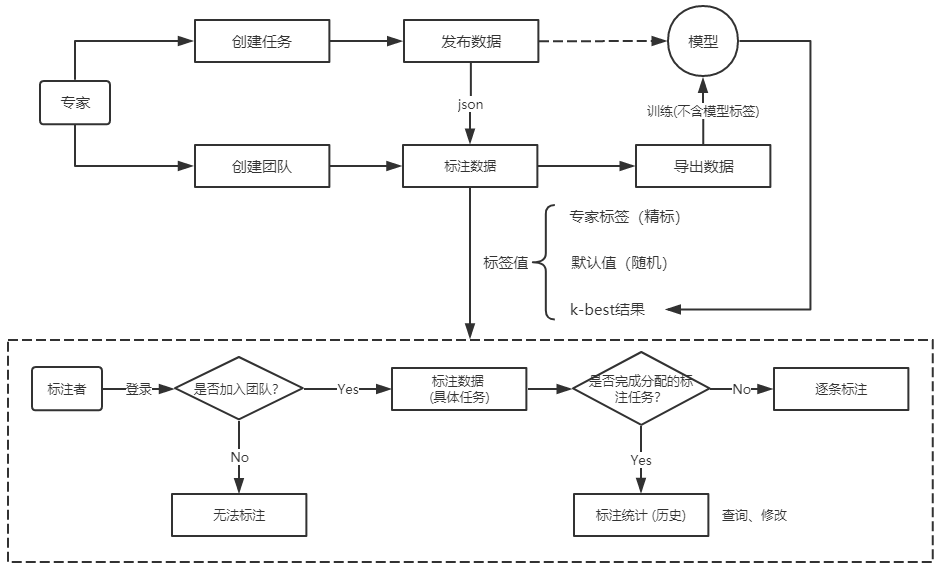
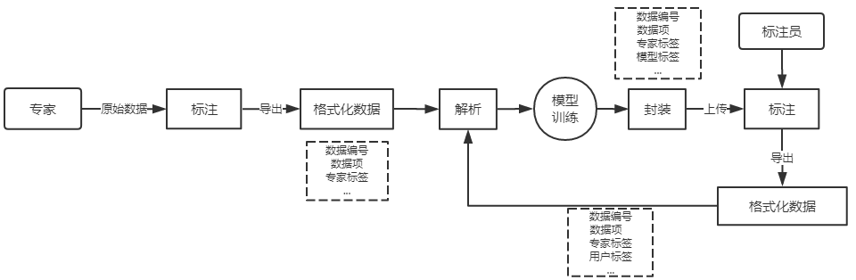
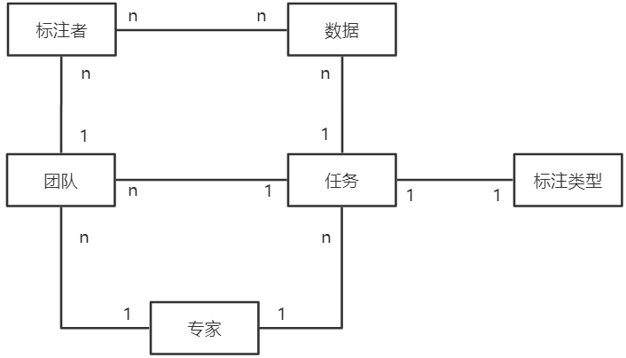

# LabelingPlatform 

## 业务流程

## 执行过程

## ER图（略去属性）

* 一个人标多条数据，一条数据被多个人标
* 一个团队有多个标注成员，一个标注员只属于某个团队
* 一个团队负责一个任务，一个任务可由多个团队完成
* 每个任务指定标注数据集，每条数据归属于某个具体任务

## 数据库设计原则
> 冗余能解决效率问题！
> 不要将相关联的数据(表)存放在不同的数据库中！
